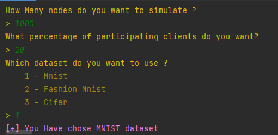
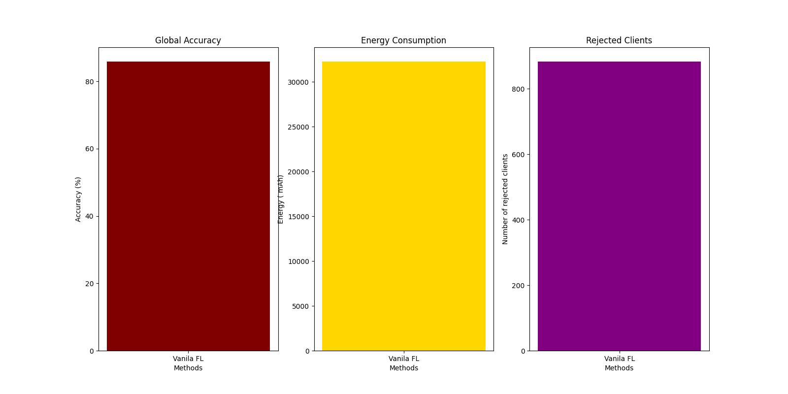
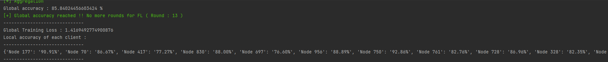

# CS_FedSIM (a simulator framework of client selection in FL that handles resource consumption in multiple IoT environnement with different capacities)

A simulator framework of the client selection step in federated learning written in python language. The simulator also considers the resources used during federated learning with various IoT device categories. 

Users have the option to create and test their own client selection techniques using the framework thanks to its modularity. Modifications also can be made to the nodes, their categories, and the resource consumption models.

The goal of this framework is to help researchers to simulate their methods in the federated learning steps, due to the lack of simulators in this field. The framework was developed in a relatively modular manner to provide the researchers complete control.


# :exclamation: Requirements 

Please use the following command to install the requirements so that the framework can operate properly :

```
pip install -r requirements.txt
```

or 

```
python3 -m pip install -r requirements.txt
```

# :grey_question: Usage

To run the script, please set the variables in [constants](/constants/) following the section **HyperParameters & Constants** and then use the following command : 


```
python main.py
```

or

```
python3 main.py
```

After the launch, please fill in your preferences like the image below: 



# :book: Full Documentation

You can consult all the documentation and details of the modules in PDF and web version on :

PDF : [CS_FedSim’s documentation.pdf](CS_FedSim%E2%80%99s%20documentation.pdf)

Web Link : [CS_FedSIM Documentation ReadTheDoc](https://aiche-mohamed-fedsim.readthedocs-hosted.com/en/latest/)

## :computer: HyperParameters & Constants

These hyperparameters are included in [constants](/constants/). The parameters are divided by Three classes:

#### FL parameters [federated_learning.py](/constants/federated_learning.py) : 

| Variable | Description |
|---|---|
| ROUNDS | the number of rounds of federated learning. |
| FINAL_ACCURACY | The desired accuracy to finish learning. |
| LOCAL_EP | The number of episodes for each node. |


#### Deep Learning parameters [model_constants.py](/constants/model_constants.py) : 

| Variable | Description |
|---|---|
| NUM_CHANNELS | Number of channels in the model. |
| NUM_CLASSES | The number of classes in the dataset. |
| LR | Learning rate. |
| MOMENTUM | Optimization function value. |
| LOCAL_BS | Local batch size. |
| BATCH_SIZE | Batch size. |

#### IoT resources parameters [resource_constants.py](/constants/resource_constants.py) : 

| Variable | Description |
|---|---|
| IMAGE_SIZE | How big an image will be on a node's storage. |
| MODEL_SIZE | How big a model will be on a node's storage.t. |
| MIN_BATTERY | The minimum battery percentage for the node to shut down. |
| POW_NODE_DISTRIBUTION | The distribution of powerful nodes in the environment. |
| MED_NODE_DISTRIBUTION | The distribution of medium power nodes in the environment. |
| LOW_NODE_DISTRIBUTION | The distribution of low power nodes in the environment. |

## :chart: Example of Node's module architecture
<center>

</center>

## :bar_chart: Analysis Results Examples





## :copyright: Note
This project is licensed under the terms of the MIT license.

## :memo: Reference

* The part of the deep learning models and their configuration was taken from [Federated-Learning-PyTorch](https://github.com/AshwinRJ/Federated-Learning-PyTorch), a FL vanilla program developed with PyTorch

* Veuillez nous signalez si vous trouvez n'importe quelle probleme ou bug et nous contactez pour répondre a tous vos questions. Notre email : m_aiche@univ-blida.dz
