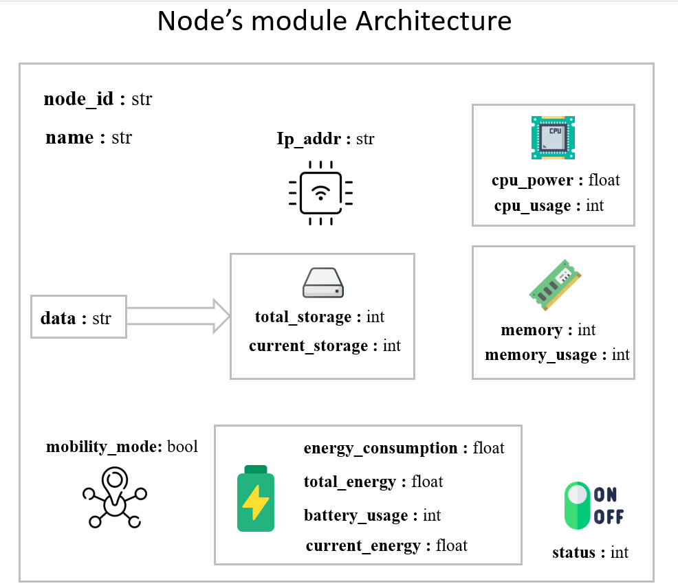

.. CSFedSim documentation master file, created by
   sphinx-quickstart on Mon Aug 29 23:11:19 2022.
   You can adapt this file completely to your liking, but it should at least
   contain the root `toctree` directive.

.. |br| raw:: html

    

CS_FedSIM's documentation!
====================================

CS_FedSIM is a simulator framework of the client selection step in federated learning written in python language. The simulator also considers the resources used during federated learning with various IoT device categories.

Users have the option to create and test their own client selection techniques using the framework thanks to its modularity. Modifications also can be made to the nodes, their categories, and the resource consumption models.

The goal of this framework is to help researchers to simulate their methods in the federated learning steps, due to the lack of simulators in this field. The framework was developed in a relatively modular manner to provide the researchers complete control.

.. toctree::
   :maxdepth: 2
   :caption: Contents:

Node Module
=================================

|br|

.. automodule:: node
    :members: Node, PowNode, MidNode, LowNode
    :show-inheritance:
    :member-order: bysource
.. toctree::
   :maxdepth: 1
   :caption: Contents:

Client selection
=================================

.. automodule:: clientSelection
    :members: ClientSelection, RandomClientSelection, ResourceClientSelection
.. toctree::
   :maxdepth: 1
   :caption: Contents:

Consumption Model
=================================

.. automodule:: consumptionModel
    :members: CPUModel, EnergyModel, MemoryModel, StorageModel
.. toctree::
   :maxdepth: 1
   :caption: Contents:

Network Module
=================================

.. automodule:: network
    :members: Network
.. toctree::
   :maxdepth: 1
   :caption: Contents:

Distributed Learning
=================================

.. automodule:: distributedLearning
    :members: dist_learning
.. toctree::
   :maxdepth: 1
   :caption: Contents:

Utility & Generation functions
=================================

.. automodule:: utils
    :members: dist_learning
.. toctree::
   :maxdepth: 1
   :caption: Contents: